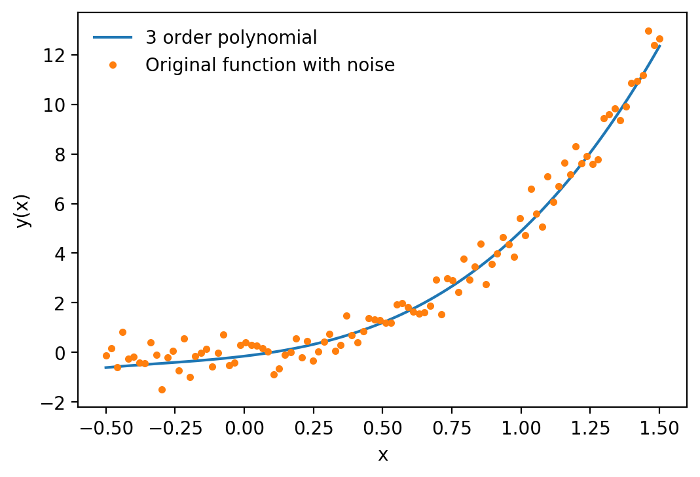
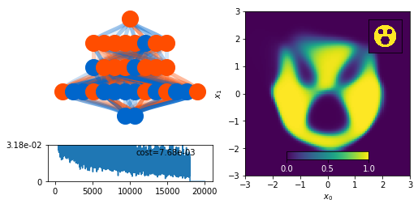
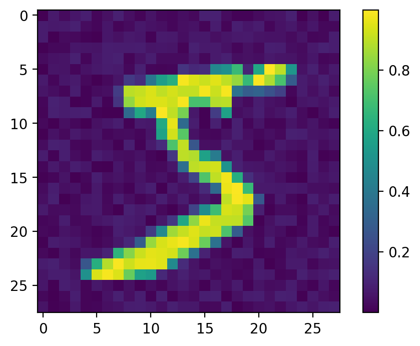
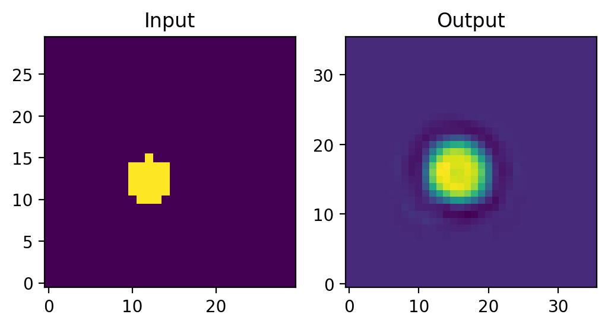
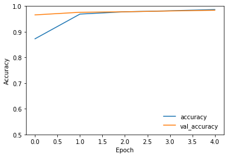
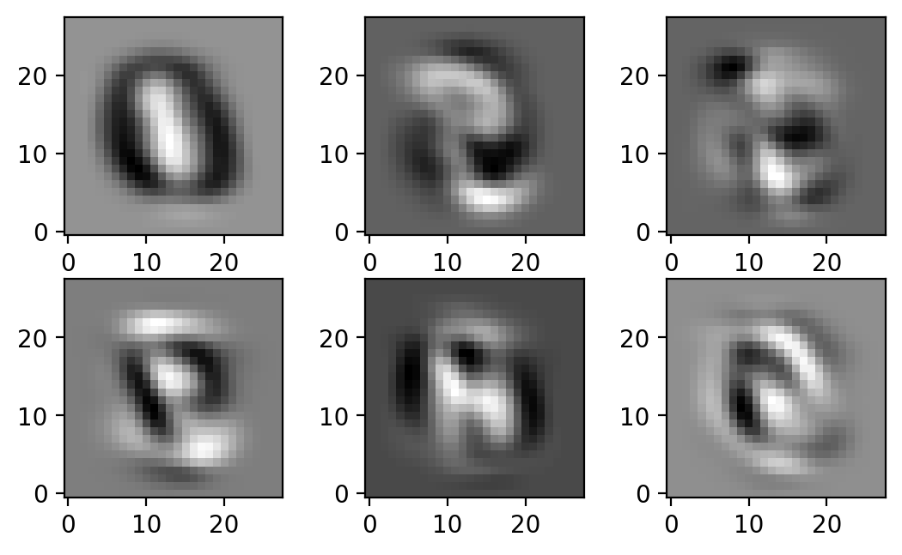
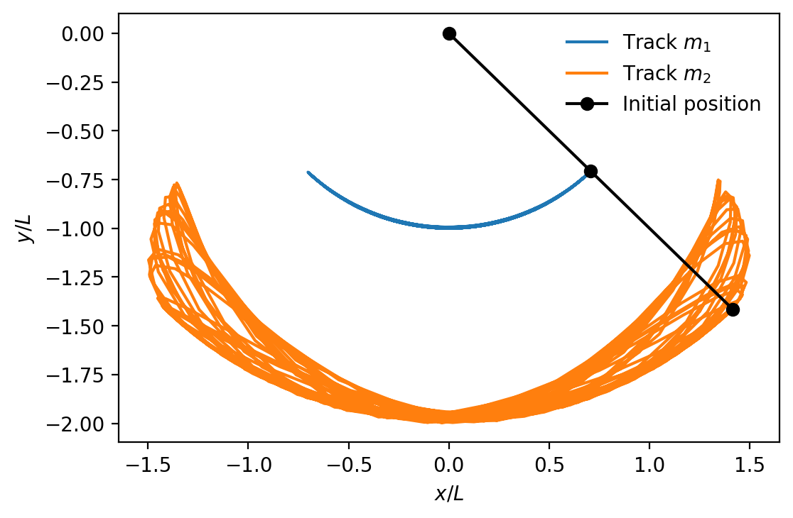

# Machine Learning for Physicists
Repository containing the projects for the Machine Learning for Physicists course offered at University College London (UCL) in 2021 Term 1, by Prof. Ryan Nichol

### Note on Jupyter Notebooks

In this repository, the Jupyter notebooks contain a mix of template code and my own contributions. A significant portion of the code within these notebooks was provided as part of a template solution, designed to guide and structure the implementation process. My contribution primarily involves adding and integrating my own code into these templates. 

## Week 1: Curve Fitting

</img>
This Jupyter notebook demonstrates curve fitting for various degrees of polynomial functions using Python's numpy library. 

  

## Week 2: Function Mimicking With NNs

</img>
In this task a neural network is trained to mimic geometric shapes: a circle, a circle with a hole, and a circle with three holes. The implementation focuses on the network's accuracy (final cost function), simplicity, training efficiency, and the clarity of the notebook presentation.

  

## Week 3: Noisy Classification of MNIST Dataset

</img>
The task for Week 3 involves a thorough analysis of neural network (NN) classification performance under varying levels of noise applied to the input data. The MNIST dataset serves as the primary input for this analysis. Independent and identically distributed (i.i.d) uniform noise is methodically introduced to the dataset to observe and quantify the impact on the neural network's classification accuracy.

  

## Week 4: Autoencoders & Classification with CNNs

</img>
### Autoencoders
The project involves creating autoencoder networks, each network will be trained on images of circles, with a restricted-size bottleneck, emphasizing network efficiency.

  

</img>
### Classification with CNNs
The project involves developing neural networks for classifying MNIST handwritten digits, with a focus on exploring different configurations of convolutional layers.
  

## Week 5: Noisy Classification of MNIST Dataset

</img>
The task entails the classification of MNIST images utilizing Convolutional Neural Networks (CNNs) combined with Principal Component Analysis (PCA). The objective is to analyze how the performance of the network varies in relation to the number of principal components (PCs) employed in the analysis.

  

## Week 6: Noisy Classification of MNIST Dataset

</img>
In this notebook, the focus is on predicting a system's behavior with incomplete information. The approach involves setting up the equations of motion for a simple double pendulum. The intriguing aspect of this exercise is to explore whether a machine learning technique can accurately predict the future position of the lower mass by exclusively using data from the lower mass's past positions. This challenge tests the predictive capabilities of machine learning models and delves into the dynamics of physical systems with limited data inputs.
  
